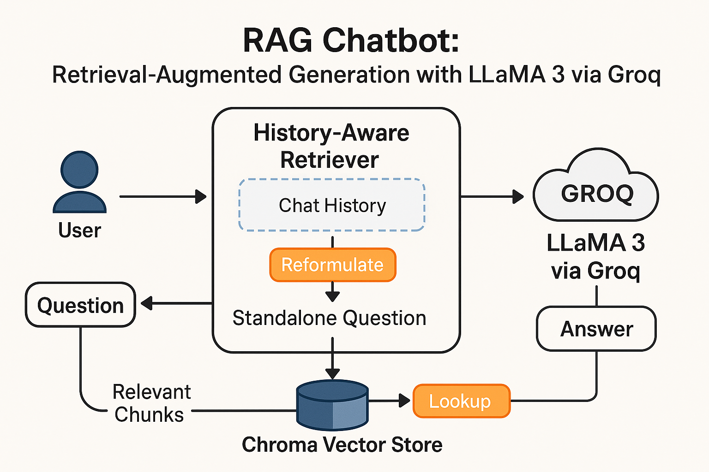

# 🔎 RAG Chatbot: Retrieval-Augmented Generation with LLaMA 3 via Groq

<p align="center">
  
</p>

---

## 📘 System Overview

<p align="justify">
This chatbot system combines a history-aware retriever with a powerful LLaMA 3-based large language model running on Groq’s ultra-low-latency inference engine. By reformulating user queries based on conversational context and retrieving relevant chunks using a Chroma vector store, the system delivers accurate, concise, and context-aware responses in real-time. LangChain orchestrates the query flow, document retrieval, and LLM prompting with modular components.
</p>

---

## 🧠 Abstract

<p align="justify"><i>
Retrieval-Augmented Generation (RAG) systems enhance LLM outputs by grounding responses in external knowledge sources. This project demonstrates a production-ready implementation of a RAG chatbot using LangChain, Chroma DB, HuggingFace embeddings, and Groq-hosted LLaMA 3-70B. The system features history-aware query reformulation, local vector search, and high-speed inference. It can be applied to customer support, enterprise Q&A, and knowledge assistants where factuality and speed are essential.
</i></p>

---

## 🚀 Key Features

- 🧠 LLM-Powered Query Reformulation (LangChain + LLaMA 3)
- 🔎 Fast Vector Search with ChromaDB & HuggingFace Embeddings
- 💬 Streaming Chat Interface (CLI)
- ⚡ Blazing-Fast Inference with Groq LPU
- 📚 Modular LangChain Chain Design

---

## 📦 Installation

### 1. Clone the repository
```bash
git clone https://github.com/h-abid97/rag-chatbot.git
cd rag-chatbot
```

### 2. Install dependencies
```bash
pip install -r requirements.txt
```

### 3. Set up environment variables
```bash
cp .env.example .env
# then edit .env to include your GROQ_API_KEY
```

## 🧪 Run the Chatbot
```bash
python main.py
```
